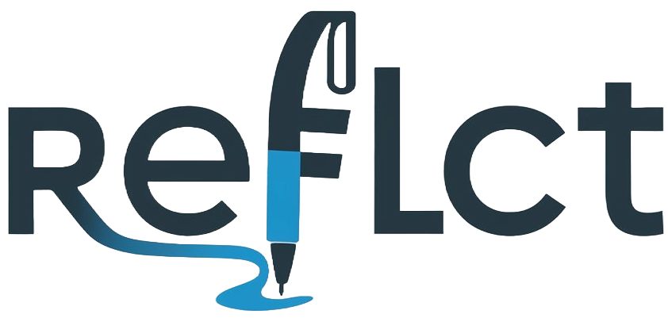

# Reflct - Modern Journaling Platform 🚀

<div align="center">
  
</div>

<div align="center">
  
  <h3>Your Personal Space for Mindful Journaling</h3>
  <p>Transform your thoughts into meaningful insights with AI-powered assistance</p>
</div>

A beautiful, AI-powered journaling platform built with Next.js, TypeScript, and Framer Motion.

## 📋 <a name="table">Table of Contents</a>

1. 🎯 [Introduction](#introduction)
2. ⚙️ [Tech Stack](#tech-stack)
3. ✨ [Features](#features)
4. 🚀 [Quick Start](#quick-start)
5. 🗂️ [Project Structure](#structure)
6. 🎨 [Components](#components)
7. 🚄 [Performance](#performance)

## 🎯 <a name="introduction">Introduction</a>

Reflct is a modern journaling platform designed to help users capture thoughts, track moods, and foster personal growth. Built with cutting-edge technologies, it features AI-powered writing assistance, stunning animations, and a focus on mindfulness.

## ⚙️ <a name="tech-stack">Tech Stack</a>

      

- 🚀 **Next.js 14** - React Framework
- 📘 **TypeScript** - Type Safety
- 🎨 **Tailwind CSS** - Styling
- 💾 **Prisma** - Database ORM
- 🔐 **Clerk** - Authentication
- 🎭 **Shadcn/ui** - UI Components
- 🎯 **Lucide Icons** - Icons
- 🤖 **AI Integration** - Writing Assistant

## ✨ <a name="features">Features</a>

- 🎨 Modern and responsive design
- 🤖 AI-powered writing assistance
- 📱 Mobile-first approach
- 🔒 Secure authentication with Clerk
- 📊 Mood tracking and analytics
- 🎯 Daily writing prompts
- 🌈 Customizable themes
- 🔐 End-to-end encryption
- 📦 Easy deployment

## 🚀 <a name="quick-start">Quick Start</a>

1. Clone the repository:
```bash
git clone https://github.com/panduthegang/Journal-App.git
```

2. Install dependencies:
```bash
npm install
```

3. Set up environment variables:
```bash
NEXT_PUBLIC_CLERK_PUBLISHABLE_KEY=
CLERK_SECRET_KEY=

NEXT_PUBLIC_CLERK_SIGN_IN_URL=/sign-in
NEXT_PUBLIC_CLERK_SIGN_UP_URL=/sign-up
NEXT_PUBLIC_CLERK_AFTER_SIGN_IN_URL=/dashboard
NEXT_PUBLIC_CLERK_AFTER_SIGN_UP_URL=/dashboard

DATABASE_URL=

PIXABAY_API_KEY=

ARCJET_KEY=
```

4. Start development server:
```bash
npm run dev
```

5. Open [http://localhost:3000](http://localhost:3000) in your browser

## 🎨 <a name="components">Components</a>

- 📝 **Editor:** Rich text editor with AI assistance
- 📊 **Analytics:** Mood tracking and insights
- 🎯 **Prompts:** Daily writing prompts
- 🎨 **Themes:** Customizable journal themes
- 🔒 **Privacy:** End-to-end encryption
- 👥 **Profile:** User settings and preferences

## 🚄 <a name="performance">Performance</a>

- ⚡ Server-side rendering with Next.js
- 📱 Optimized for mobile devices
- 🔄 Incremental static regeneration
- 📦 Optimized bundle size
- 🎯 Edge runtime support
- 🌐 Global CDN deployment

<p align="center">Made with 💗 by Harsh Rathod</p>
